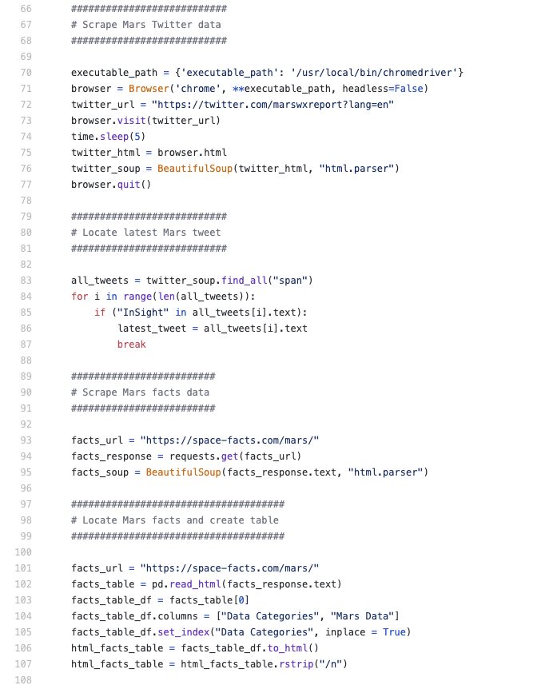
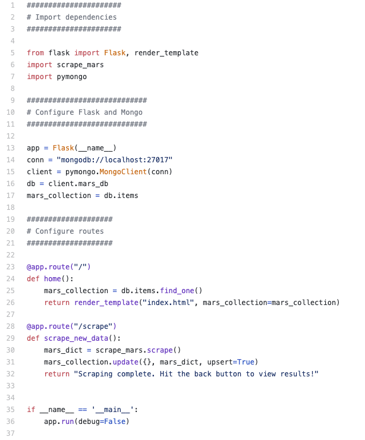

# Web Scraping Challenge (Grade: A)
 
### Table of Contents:

 1. [Project Goals](#project-goals)
 2. [Tools and Solutions](#tools-and-solutions)
 3. [Outcomes and Lessons Learned](#outcomes-and-lessons-learned)
 4. [App Screenshots](#app-screenshots)
 5. [Coding Screenshots](#coding-screenshots)

## Project Goals
This was my most challenging assignment to date! I had to master the art of web scraping, which requires the creation of a <a href="https://www.python.org/">Python</a>-driven program that pulls live data from third-party websites, Twitter accounts, and other online sources.

## Tools and Solutions
The first step in my data-gathering process was designing a connection to an <a href="https://www.sqlite.org/index.html">SQLite</a> database provided by the instructor. I used <a href="https://pandas.pydata.org/">Pandas</a> and <a href="https://matplotlib.org/">Matplotlib</a> to wrangle and visualize it contents, and then I created <a href="https://hackersandslackers.com/flask-routes/">Flask API routes</a> that returned <a href="https://www.json.org/json-en.html">JSON</a> lists when queried. I also completed the bonus assignments, using Matplotlib to visualize a series of statistical analyses of the temperature-related data.

## Outcomes and Lessons Learned
I loved this project! It drew together nearly all of the disciplines that our class has covered to date, and it was our first opportunity to make our own findings available to the web via Flask. I hope to use these tools more in the future. You can check out my code <a href="https://github.com/sonder74/sqlalchemy-challenge/blob/master/sqlalchemy-challenge.ipynb">here</a> and my Flask app <a href="https://github.com/sonder74/sqlalchemy-challenge/blob/master/climate.py">here</a>.

## Coding Screenshots

 

