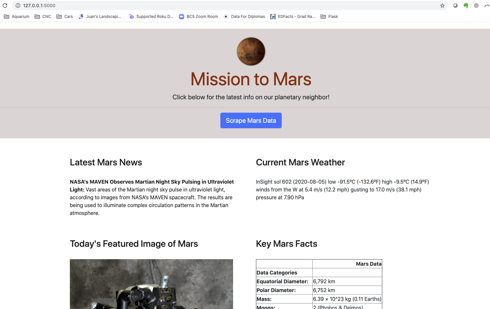
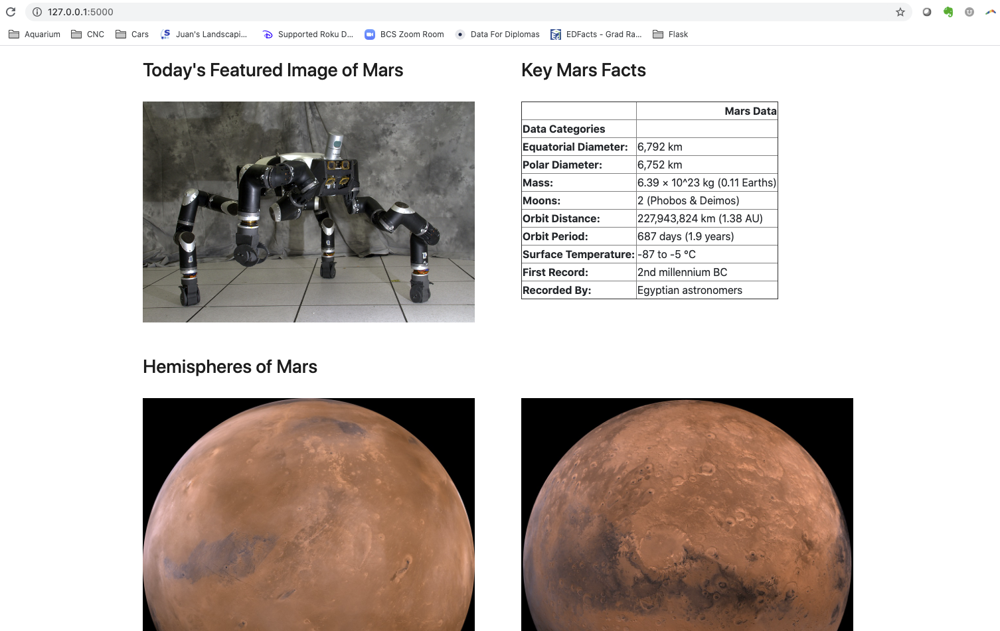

# Web Scraping Challenge (Grade: A)
 
### Table of Contents:

 1. [Project Goals](#project-goals)
 2. [Tools and Solutions](#tools-and-solutions)
 3. [Outcomes and Lessons Learned](#outcomes-and-lessons-learned)
 4. [App Screenshots](#app-screenshots)
 5. [Coding Screenshots](#coding-screenshots)

## Project Goals
This was my most challenging assignment to date! I had to master the art of web scraping, which requires the creation of a <a href="https://www.python.org/">Python</a>-driven program that pulls live data from third-party websites, Twitter accounts, and other online sources. The project's theme focused on the planet Mars and required up-to-the-minute data from the National Aeronautics and Space Administration (NASA).

## Tools and Solutions
To scrape data from NASA's Jet Propulsion Laboratory, Twitter, and other sources, I had to make use of <a href="https://en.wikipedia.org/wiki/Beautiful_Soup_(HTML_parser)">Beautiful Soup</a>, a Python package designed for parsing <a href="https://en.wikipedia.org/wiki/HTML">HTML</a> and <a href="https://en.wikipedia.org/wiki/XML">XML</a> documents. Crafting Python code to locate particular datapoints on complex webpages can be extremely tricky, and I succeeded only after discovering the <a href="https://www.datacamp.com/community/tutorials/python-time-sleep?utm_source=adwords_ppc&utm_campaignid=1565261270&utm_adgroupid=67750485268&utm_device=c&utm_keyword=&utm_matchtype=b&utm_network=g&utm_adpostion=&utm_creative=295208661496&utm_targetid=aud-299261629574:dsa-429603003980&utm_loc_interest_ms=&utm_loc_physical_ms=9028322&gclid=Cj0KCQjw28T8BRDbARIsAEOMBcyqdyggLi4lUipH27YAIpdiHlKZ_lei9cjAy5jYoR2U91hlNKGeg2AaAiA2EALw_wcB">time.sleep()</a> function, which introduces intentional delays into a program's runtime. Once my <a href="https://github.com/sonder74/web-scraping-challenge/blob/master/scrape_mars.py">my scraping program</a> was completed, I created <a href="https://github.com/sonder74/web-scraping-challenge/blob/master/app.py">a Flask application</a> and routed the results to <a href="https://github.com/sonder74/web-scraping-challenge/blob/master/screenshots/scrape_page_1.png">a simple landing page</a>, so that the final outcome could be viewed and refreshed via a local server.

## Outcomes and Lessons Learned
This project involved more trial-and-error than any of the preceding assignments, but the hard work ultimately paid off. It was exciting to see live data pulled into <a href="https://github.com/sonder74/web-scraping-challenge/blob/master/screenshots/scrape_page_1.png">my "Mission to Mars" feed</a>, and I felt much more confident about my ability to gather, process, and display data in a dynamic and useful way.

## App Screenshots

 

## Coding Screenshots

 

